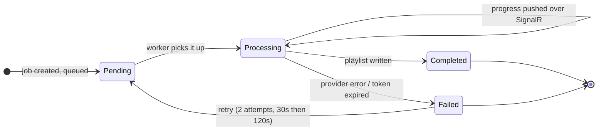

# RadioWash redesign brief — Apple Music single-provider

**Status:** current as of 2026-08-04. Screenshots in `screenshots/` show the app
_before_ this redesign.

---

## 1. What RadioWash is

RadioWash takes a playlist containing explicit tracks and produces a clean
version of it — same songs, radio edits substituted where they exist. The user
picks a playlist, RadioWash matches each track to a clean counterpart, and
writes a new playlist back to their library.

The paid tier ($5/mo) keeps that clean playlist in sync: when the source
playlist changes, the clean copy follows.

## 2. What is changing

RadioWash is becoming an **Apple Music–only** product. Spotify support is being
withdrawn from the interface entirely.

This is not a rebrand or a re-centering — it is a removal. The redesign should
be drawn as though Apple Music is the only music service that exists.

**Why:** Spotify changed its API rules so that development-tier applications may
serve only **5 users**. That is not a product RadioWash can ship, so Spotify is
being withdrawn rather than maintained in a crippled state.

**Later:** a second platform (Tidal is the leading candidate) is likely, but is
unresearched. The backend keeps its provider abstraction (`IMusicService`) so a
second service can be added without a rewrite. **The UI should not
pre-emptively expose that seam.** Do not design provider tabs, provider
pickers, or "copy to another service" flows for a second provider that does not
exist yet. Designing for a hypothetical platform produces worse screens today
and rarely fits the platform you actually add.

### Decisions already made

| Decision          | Choice                                                                                                              |
| ----------------- | ------------------------------------------------------------------------------------------------------------------- |
| Provider framing  | Single-provider. No provider chrome in the UI. Abstraction stays in backend code only.                              |
| Spotify users     | **Clean removal.** There are **zero production users**, so there is no migration and no legacy data to accommodate. |
| Paid tier         | **Stays.** Auto-Sync becomes a first-class Apple Music feature, visible-but-locked for free users.                   |
| Onboarding        | **A guided route**, not a dashboard card. See §6.                                                                   |
| Email sign-in     | **Magic link**, not a password. See §13.                                                                            |
| Sharing           | **Revived** as a growth surface — but it must be rebuilt, not restored. See §14.                                    |
| Visual identity   | **Warm editorial** — warm off-white ground, serif display, deep teal accent. Palette in §12.                        |

**No existing users.** This is worth stating plainly because it removes a whole
class of constraint: there is no migration, no grandfathering, no legacy job
history, and no backward compatibility to preserve. Design the app as though it
is launching for the first time — because it effectively is.

## 3. North star

> RadioWash makes a clean copy of any Apple Music playlist, and keeps it clean.

One service. One job. The interface should make the _playlist_, not the
plumbing, the subject of every screen.

## 4. The core problem with the current design

The current app is not merely styled like Spotify — it is **structured** around
Spotify, in four compounding ways.

**The theme is literally Spotify's.** `globals.css` is headed "Spotify Theme."
`--primary` is `#1db954`, Spotify's green. The dark background is `#121212`,
Spotify's. See `tokens-baseline.md`.

**The layout assumes two providers.** The dashboard leads with two connection
cards side by side, then a provider tab bar, then a clean-vs-copy radio pair.
Roughly the top third of the screen is spent on a choice that will no longer
exist.

**The default is Spotify even when Spotify is absent.** The clearest evidence is
`screenshots/dashboard-apple-only__light__desktop.png`: a user with **only**
Apple Music connected lands on the Spotify tab and is told _"Connect Spotify to
Get Started"_ — while their connected service sits unselected one tab over,
with playlists ready to use. This is the single most important screenshot in
the bundle.

**The marketing never mentions Apple Music.** The landing page, page title, SEO
metadata, OG image, and JSON-LD are Spotify-only, in a product that already
supports both.

## 5. What the redesign must produce

### Screens that survive, simplified

| Screen                         | What changes                                                                                           |
| ------------------------------ | ------------------------------------------------------------------------------------------------------ |
| Landing (`/`)                  | Rewritten around Apple Music. Currently mentions it zero times.                                        |
| Auth (`/auth`)                 | Spotify removed; Apple + Google + email added. See §13, and §6 on the two-step problem.                |
| Dashboard (`/dashboard`)       | Provider cards → one connection state. Tab bar removed. Clean/copy radio pair → a single clean action. |
| Job detail (`/jobs/[id]`)      | Largely intact; four states must all be designed (see §7).                                             |
| Sync (`/dashboard/sync`)       | Stays. Now Apple-capable — see §8. Visible-but-locked for free users — see below.                      |
| Subscription (`/subscription`) | Stays, plus success/cancel returns.                                                                    |

### How Auto-Sync should read for a free user

**Visible and locked, not hidden.** A free user should be able to see that
Auto-Sync exists and understand what it does — but the encouragement stays
gentle. The product should not feel like it is selling.

Practically, that means: show the feature and its value honestly, once, where it
is contextually relevant (a user who has just made a clean playlist is the
natural moment). Avoid recurring prompts, interstitials, dismissible banners
that return, or upgrade language on screens where sync is not the subject.
One clear locked affordance beats three nudges.

### Screens that need to exist and don't

- **Onboarding — a guided route.** There is no welcome or first-run route today;
  a brand-new user lands on a full dashboard with an empty list and inline
  "connect" text. This becomes a designed sequence that carries the user from
  sign-in through Apple Music authorization to a first clean playlist. It is the
  highest-value new screen in the redesign. See §6.
- **Legal pages.** No privacy or terms routes exist. `sitemap.ts` lists only
  `/`.

## 6. The connection flow is two steps, and that is not incidental

This is the sharpest UX problem in the product and deserves explicit design
attention.

Signing in with Apple **does not** grant music access:

- Apple **identity** sign-in (`signInWithApple`) requests `name email` only.
- Apple **Music** access needs a separate MusicKit authorization producing a
  Music User Token, which requires an active Apple Music subscription.

So the real flow is: _sign in with Apple_ → _land somewhere_ → _separately
authorize Apple Music_ → _then_ the app works. Today the second step is a card
buried on the dashboard, which is why a signed-in user can see an empty app and
no clear next action.

**Decision: this becomes a guided onboarding route.** Not better copy on a
dashboard card — an actual sequence the user is walked through, so someone who
is unsure why they are being asked for a second authorization understands what
it is for and what happens next.

The route needs to cover four moments:

1. **Sign in** — Apple identity.
2. **Explain, then authorize** — say plainly *why* Apple Music access is needed
   and what RadioWash will do with it, before the MusicKit prompt appears. An
   unexplained second permission dialog is where people drop out.
3. **Authorized, nothing cleaned yet** — hand the user directly into picking a
   first playlist. Do not deposit them on an empty dashboard.
4. **Blocked** — no Apple Music subscription means step 2 *cannot* be completed.
   This is a dead end today with only an error line. It needs a real screen that
   explains the requirement without reading as a failure of the user.

The interstitial state — signed in, not yet music-authorized — must be a
designed screen, not an empty dashboard with a card on it.

## 7. States that must be designed

Job status is a four-value enum (`api/Models/Domain/CleanPlaylistJob.cs`):
`Pending`, `Processing`, `Completed`, `Failed`. All four appear in the UI, in
both the dashboard job list and the job detail page.

`Processing` is the state most worth designing carefully: jobs report live
progress over SignalR, and a large playlist can sit here for minutes. The
current treatment is a bar plus "88 of 187 tracks processed"
(`screenshots/job-processing__light__desktop.png`).

Beyond job states, these need designed treatments:

- **Empty:** no playlists, no jobs, nothing connected.
- **Partial match:** a clean version could not be found for some tracks. This is
  normal, not an error, and the current UI barely distinguishes them.
- **Reconnect required:** see §8.
- **Plan limit reached:** 10 sync configs (HTTP 403).
- **No Apple Music subscription:** blocks music authorization entirely.

## 8. Apple Music constraints that force design decisions

Full detail in `constraints.md`. The four that most affect layout:

| Constraint                                        | Design consequence                                                                                                                        |
| ------------------------------------------------- | ----------------------------------------------------------------------------------------------------------------------------------------- |
| Library playlists report **no track count**       | A playlist card cannot show "142 tracks." Do not design a card that depends on that number.                                               |
| Library IDs (`p.…`, `i.…`) have **no public URL** | There is no "Open in Apple Music" link and no per-track link for library items. Do not design a card with a link slot that will be empty. |
| **No token refresh** — user token lasts ~6 months | A periodic reconnect prompt is required. This has no Spotify equivalent and is permanent, not transitional.                               |
| **No user profile** from Apple                    | Display name and avatar must come from the Supabase identity, not the music service.                                                      |

### Auto-Sync has a real build dependency

Sync computes a delta and applies **both additions and removals**. Removal does
not exist on the Apple path today:

- `IMusicService` (the shared abstraction) is **add-only** — it has
  `AddTracksToPlaylistAsync` and no remove method at all.
- `RemoveTracksFromPlaylistAsync` exists only on `ISpotifyService`.
- `PlaylistSyncService` depends on `ISpotifyService` directly, not
  `IMusicService`.

So Apple-capable sync requires extending the shared interface and implementing
removal against Apple's library API — not merely swapping a dependency.

**For design:** treat sync as a fully working Apple Music feature. The redesign
does not ship until this parity exists, so design the finished state — additions
and removals both — with no hedging in the copy. Building the removal path is an
engineering prerequisite, not a design constraint.

## 9. Component reality

The redesign is also a consolidation job. Current state:

- **Only four shadcn primitives are installed**: `button`, `dropdown-menu`,
  `sonner`, plus custom `ClientDate` and `theme-toggle`. There is no card,
  dialog, input, select, badge, tabs, skeleton, or tooltip.
- Consequently **most controls are hand-rolled Tailwind**, and visual
  consistency is low. Playlist cards are written twice in
  `dashboard-client.tsx` — a desktop grid variant and a separate mobile list
  variant with duplicated markup.
- **There is no modal primitive at all.** Any design calling for a dialog
  introduces one.
- The landing page has **its own nav and footer**, entirely separate from the
  app's `GlobalHeader`. Two disconnected chromes.
- **The share components are dead code**: three of them (~800 lines) with their
  JSX commented out; `ShareSuccessModal` returns an empty `
`. Sharing is
  being revived as a feature (§14), but these are not the starting point — they
  share a URL, which does not exist for Apple library playlists.

## 10. Content guidance

Use real, awkward data when mocking screens. The capture fixtures deliberately
include a 60-character playlist name, a one-track playlist, and an empty
description, because tidy three-word names hide the layout failures that matter.

Do not design around playlist artwork. Fixtures render "No Image" placeholders,
and Apple library artwork is not reliably available.

## 11. What not to do

- **Do not swap Spotify green for Apple's pink/red.** That repeats the original
  mistake — deriving product identity from a service's brand — in a new color.
  RadioWash needs its own.
- **Do not design a provider picker** "for later." See §2.
- **Do not show track counts** on playlist cards. See §8.
- **Do not treat the reconnect prompt as an error state.** On Apple it is a
  normal, recurring part of the lifecycle.
- **Do not design "coming soon," beta, or waitlist states for any feature.**
  The redesign ships only once Apple Music parity is complete, so every feature
  drawn is a feature that works. Nothing is placeheld.
- **Do not soften the corners.** The chosen direction (§12) uses a 3px radius.
  Warm ground plus rounded cards is the generic template look it exists to
  avoid.
- **Do not let the teal decorate.** It belongs on the primary action and on
  progress. Not links, chips, headers, or icons.

## 12. Visual identity — decided: warm editorial

**Direction C is chosen.** RadioWash gets a warm off-white ground, a serif
display face, and a deep teal accent drawn from print rather than from software.

This is the most differentiated of the three directions considered and the most
demanding to execute. It was chosen over the safer near-monochrome option
because RadioWash should feel like something rather than disappear into its
function — nothing else in music software looks like this.

### The palette

Starting values, not a finished system. Contrast must be audited per pairing
before these are locked.

**Light**

| Token | Value | Role |
| ----- | ----- | ---- |
| `--background` | `#FBF8F2` | Warm off-white canvas |
| `--surface` / `--card` | `#F3EEE3` | Raised surfaces |
| `--foreground` | `#221E17` | Deep warm neutral text |
| `--muted-foreground` | `#6F6759` | Secondary text |
| `--border` | `#E0D7C6` | Rules and dividers |
| `--primary` | `#0F5F5C` | Deep teal — primary action, progress |
| `--primary-foreground` | `#FBF8F2` | Text on teal |
| `--primary-muted` | `#DCEAE7` | Tinted backgrounds |

**Dark** — the hardest part of this direction. Warm palettes resist dark mode;
these values keep the warmth in the neutrals rather than sliding to cool grey.

| Token | Value | Role |
| ----- | ----- | ---- |
| `--background` | `#17140F` | Warm near-black |
| `--surface` / `--card` | `#201C15` | Raised surfaces |
| `--foreground` | `#F0E9DC` | Warm off-white text |
| `--muted-foreground` | `#A89B85` | Secondary text |
| `--border` | `#322B21` | Rules and dividers |
| `--primary` | `#5FB3AB` | Lifted teal — the deep teal fails on dark |
| `--primary-foreground` | `#10201E` | Text on teal |
| `--primary-muted` | `#1D2E2C` | Tinted backgrounds |

**Semantic families** shift warm to sit on this ground rather than keeping their
current cool values:

| Family | Light | Dark |
| ------ | ----- | ---- |
| `success` | `#3F6B34` | `#86B677` |
| `warning` | `#9A6A11` | `#D6A24E` |
| `error` | `#93341F` | `#D98368` |

### Executing this direction

Three things carry it. If any is done carelessly the direction fails and reads
as an unfinished cream template.

**The serif is doing the work.** The display face is the single largest carrier
of personality here, and it is not yet chosen — the exploration used a system
fallback stack. Pick a real face with intent: it should have warmth and some
editorial character without tipping into decorative. Use it for headings,
playlist names, and figures. Body and UI text stay in a clean sans; a
wall of serif would read as a magazine, not a tool.

**Corners stay tight.** `--radius: 3px`, not the current `0.5rem`. Soft rounded
cards on a cream ground is precisely the generic look this direction has to
avoid. Sharp corners plus warm color reads considered; round corners plus warm
color reads like a template.

**The teal is rationed.** It appears on the primary action and on progress.
Not on links, not on chips, not on section headers, not on icons. The moment
it decorates, the restraint collapses and the palette turns muddy against the
warm ground.

### Directions not taken

Recorded so the decision is not relitigated.

**A. Extend the existing purple** (`#7c3aed`). Cheapest — the token already
exists — but violet-on-dark is the house style of developer tooling and would
not distinguish the product.

**B. Ink and a single accent** (near-monochrome, one blue). The safe and
arguably most correct choice: restraint suits a tool people use briefly and
trust with their library. Rejected as forgettable by design. Its core
discipline — one accent, rationed strictly — is carried into C above and is
worth preserving.

### The constraint

RadioWash currently has no identity of its own. `--primary` is Spotify's green,
the dark canvas is Spotify's `#121212`, and the one non-Spotify token
(`--brand`, a purple) is used only for tabs, the sync promo, and the Free badge.

Two rules for whatever replaces it:

- **Not Apple's pink/red.** Borrowing Apple's identity repeats exactly the
  mistake being corrected — and it also implies an endorsement that does not
  exist.
- **It must survive a second platform.** Tidal or whatever follows should be
  able to join without the palette becoming a lie. This argues for an identity
  that reads as "clean audio tooling," not "the Apple Music app."

### Still to produce

The palette above settles color. These remain undefined and must be built out
(see `tokens-baseline.md`):

- **A display serif.** Not yet chosen — the exploration used a system fallback.
  This is the largest carrier of the direction's personality, so choose it
  deliberately rather than defaulting to Georgia.
- **A body/UI sans** to pair with it, and a rule for which face goes where.
- **A type scale.** There is none; the app uses Tailwind defaults throughout.
- **A spacing rhythm.** There is none; padding is chosen per component.
- Values for `--feature`, `--chart-1…5`, and `--sidebar-*`, which the Tailwind
  config references but the CSS never defines. Chart colors in particular need
  deriving from the warm palette rather than pulled from a default ramp.
- **A contrast audit** of every foreground/background pairing in both themes.
  The warm dark theme is the risk area — verify before locking.

## 13. Sign-in methods

**Not yet implemented — design ahead of the build.**

Today `/auth` offers exactly two options, both OAuth: Spotify and Apple
(`web/src/app/auth/actions.ts`). Spotify is being removed. The replacement set:

| Method | Status | Notes |
| ------ | ------ | ----- |
| **Apple** | Exists, stays | Kept despite awkward local-testing setup. It is the natural pairing for an Apple Music product. |
| **Google** | **New** | The practical everyday path; avoids Apple sign-in friction. |
| **Email** | **New** | Fallback for users who want neither OAuth provider. |
| ~~Spotify~~ | **Removed** | — |

### What this means for the design

**Three sign-in options, not one.** An earlier draft of this brief said "one
sign-in path" — that is wrong. The auth screen needs to present three methods
without becoming a wall of buttons. Consider a clear primary with the others
secondary, rather than three equal-weight choices.

**Identity is decoupled from music access.** This reinforces §6 rather than
complicating it: signing in with Google or email makes it *obvious* that a
separate Apple Music authorization is still required. The two-step flow stops
looking like a bug and starts looking like what it is. Design the onboarding
sequence so the Apple Music step reads as expected regardless of how the user
signed in.

**Email sign-in is a magic link, not a password.** No password field, no reset
flow, no strength meter, no confirmation step. The screens it does need, none of
which exist today:

1. **Enter email** — a single field and one button.
2. **Check your inbox** — the screen the user sits on while they switch to their
   mail app. It must name the address the link went to (so a typo is visible),
   offer a resend with a sensible cooldown, and let them correct the address
   without starting over.
3. **Link expired or already used** — a recoverable state, not an error page.
   One button: send a new link.
4. **Opened on a different device.** The common real-world case: request the
   link on a laptop, tap it on a phone. Design what the laptop shows, and decide
   whether the phone continues the session or tells them to return.

Moment 4 is the one usually forgotten, and it is the one users hit most.

> **Note the interaction with §6.** A magic-link user arrives already
> mid-sequence: they have crossed a device boundary and an inbox detour before
> reaching the Apple Music authorization step. The onboarding route must pick
> them up gracefully rather than assuming an unbroken flow from the auth screen.

**Apple sign-in returns limited identity.** Apple's `name email` scope may yield
a relay email address and, if the user hides their name, no display name. The
account/profile surface must not assume a real name is available.

---

## 14. Sharing — revived, but rebuilt

**Decision: sharing stays and is treated as a growth surface.** A user who has
just cleaned a playlist is at the moment of highest goodwill in the product,
and that is the natural point to let them tell someone about it.

Three components already exist for this (`SharePlaylistButton`, `ShareCard`,
`ShareSuccessModal` — roughly 800 lines) with their JSX commented out. **Do not
restore them.** They were written for Spotify and their central assumption does
not survive the move to Apple Music.

### Why the old approach cannot work

The old code shares a **URL**: `playlistUrl`, falling back to
`window.location.href`. On Apple Music both are dead ends.

- Apple **library** playlists (`p.xxxxx`) have **no public URL** — see
  `constraints.md`. There is nothing to link to.
- The fallback, `window.location.href`, is a private `/jobs/123` route behind
  authentication. A recipient gets a login wall.

So a revived URL-share would post either a broken link or a sign-in page. That
is worse than no share button.

### What to design instead

**Share an artifact, not a link.** The shareable thing is the *result* — "I
cleaned a 187-track playlist and 61 of 64 tracks found clean versions" — as an
image or card that stands on its own without a destination.

This suits the constraint rather than fighting it. A generated card can carry
real substance: playlist name, track count, how many were swapped, and a small
sample of before → after pairs. That is more interesting than a link anyway, and
it works identically on every future platform.

**Design decisions needed:**

- **What the card contains.** It must read on its own in a feed. Consider the
  before/after framing — that is the product's whole story in one image.
- **Where the invitation appears.** Job completion is the moment. Once, at the
  end, not a persistent button on every screen.
- **How it degrades.** `navigator.share` exists on mobile and mostly not on
  desktop. Design both: native share sheet where available, download-or-copy
  where not.
- **Whether RadioWash is named on the card.** It is a growth surface, so
  presumably yes — but it should read as a mark, not a watermark.

**Privacy:** the card exposes a user's playlist name and listening. It is
user-initiated, so that is their call — but nothing should be shareable by
default, and no share artifact should be generated until asked for.

> **Do not design a "share to Twitter/Facebook" row.** The old components had
> one. Named-network buttons date quickly, and the platforms change terms. A
> single share action that hands off to the OS (or copies the image) ages far
> better.

